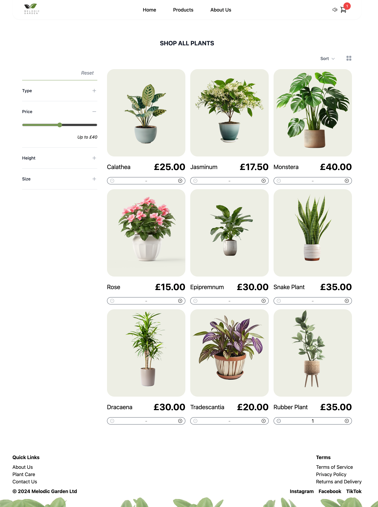
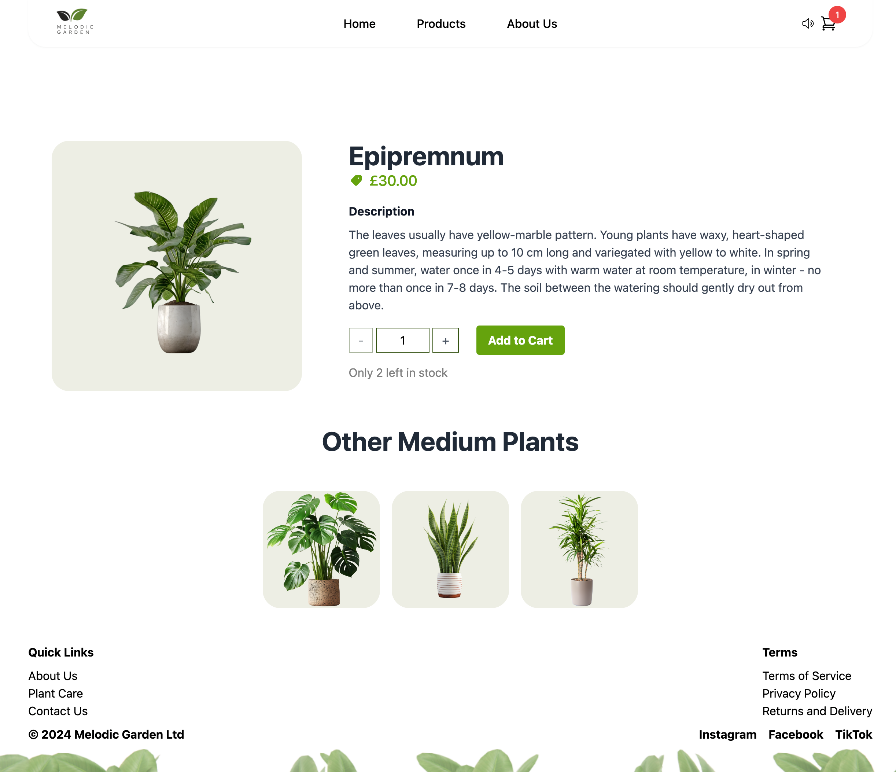
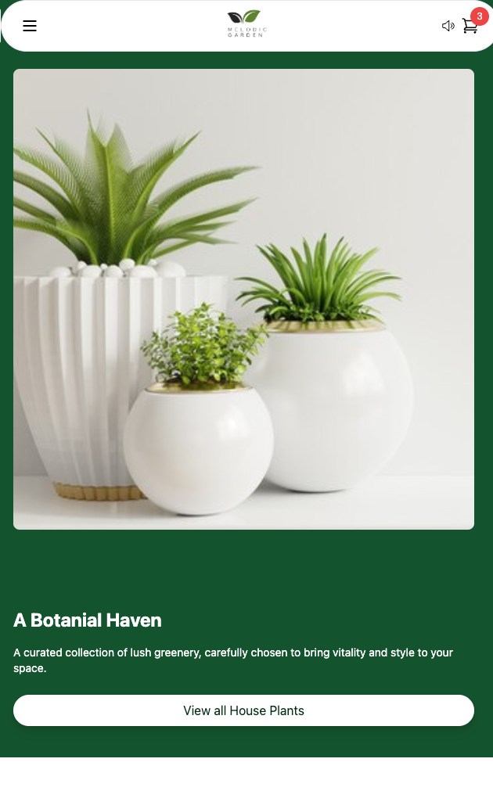

# Melodic Garden

## Description 
We are proud to present 'Melodic Garden' An immersive online store for plant enthusiasts. Offering a curated selection of plant for every space. Our website is designed to provide a seamless relaxing shopping experience, coupled with valuable information and insights for plant lovers of all levels.

## Website Usage/Visuals

### Homepage:
Access a list of featured plants or shopy by catagory 

### Shop All Plants:
Utilise the filter feature to sort through all available plants on the website

### Product Page + Recommendations:
View full details of any selected plant then review our recommendations from that plant catogory

### Shopping Cart Modal:
A quick view of your shopping cart as products are added

### Cart Page:

### About Page:  

### Mobile Responsive:  

  
  
  

  
  
  

### Enjoy soothing background music while browsing
To Listen Click [HERE](https://pixabay.com/music/meditationspiritual-peaceful-garden-healing-light-piano-for-meditation-zen-landscapes-112199/) 

## Support
For support with App Features email: Company@domain.com

## Authors and Acknowledgment
Thank you to all collaborators on this Project
  

| **Components & Functionality**            | **Contributors**                       |
|--------------------------|----------------------------------------|
| **Wireframe + Branding**   | Haydawn | 
| **React / Netlify**   | James |     
|  **Navigation Functionality**   | Jack       
| **Navbar + Audio Functionality** | Jack / Sophie| 
| **Jumbotron + Page Divider** | Haydawn |
| **Featured Plants Section + Shop Category** | Sophie |
| **Product Page & Recommendations** | Adam |
| **Product Filter** | James |
| **Footer** | James |
| **Cart Page**   | Haydawn / James / Adam|  
| **Checkout Functionality** | Adam / James

## References

### Packages & APIs Used
- [@vitejs/plugin-react](https://github.com/vitejs/vite-plugin-react/blob/main/packages/plugin-react/README.md) uses [Babel](https://babeljs.io/) for Fast Refresh
- [@vitejs/plugin-react-swc](https://github.com/vitejs/vite-plugin-react-swc) uses [SWC](https://swc.rs/) for Fast Refresh
- 
- 
- 

### Libraries Used
- [Tailwind Css](https://tailwindcss.com/)
- 
- 

## Deployed Project 
[Website Link]()

## License

This project is licensed under the MIT License.

©2023. Group-2-p2. All Rights Reserved.